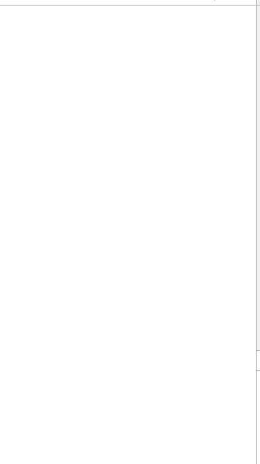

##Introduction
This project was based on an article from Ray Wenderlich[Origin Article](https://www.raywenderlich.com/87268/3d-effect-taasky-swift). I translate it in Objective-C from Swift.
##Demo Effects
